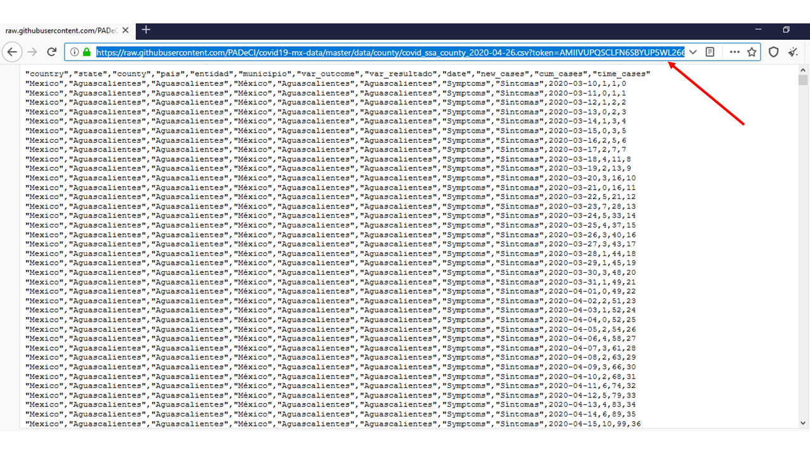

<p align="center">

</p> 


# Datos de COVID-19 en Mexico (versión en español) 
# Sobre este repositorio :open_book:
[PADeCI](https://twitter.com/PADeCI1) es un equipo de investigación interdisciplinario ubicado en el [CIDE Región Centro](https://www.facebook.com/cideregioncentro) en Aguascalientes, México. Actualmente, uno de sus principales proyectos involucra el procesamiento, el análisis y la creación de datos sobre COVID-19 en México, necesarios para la toma de decisiones basada en evidencia en contextos de incertidumbre. Este repositorio ofrece datos de la propagación de la pandemia de COVID-19 en México, incluye información sobre el número de personas que se han sometido a la prueba de COVID-19, con síntomas (sospechosas), enfermas (confirmadas), hospitalizadas, fallecidas, en cuidados intensivos e intubadas. Los datos son abiertos para ser utilizados por cualquier persona, otorgando el crédito adecuado.

Este repositorio corresponde a la primera etapa del análisis de datos: el proceso de limpieza. La información generada en esta etapa es la fuente primaria de información para el modelaje matemático, las proyecciones y las publicaciones de PADeCI. Además de ser una herramenta para la investigación de PADeCI, el contenido de este repositorio sirve para que cualquier persona interesada replique el proceso de limpieza de datos hecho por el equipo de PADeCI, siguiendo así los principios científicos de _transparencia_ y _replicabilidad_. 

# Requisitos :computer:
R version 3.6.2 (ésta es la versión recomendada para evitar errores en el código, también conocidos como _bugs_). 

# Uso :inbox_tray:
Cualquier persona puede utilizar los datos creados por PADeCI o replicar el proceso de limpieza, ya sea clonando este repositorio en su computadora o descargando archivos específicos. Los datos también se pueden utilizar sin necesidad de descargar, ni clonar el respositorio: basta con utilizar el url que GitHub provee de la base de datos específica que se desea utilizar en formato raw, a continuación se presenta un ejemplo de cómo acceder a los datos usando este método.

## Ejemplo de uso de los datos (extracción directa del url con R)
**1. Seleccionar la base de interés**

El repositorio incluye numerosas bases de datos (más detalles en la sección de análisis en el apartado de descripción de las carpetas). En este caso utilizaremos la base de casos COVID-19  desagregada a nivel municipal actualizada el 4 de junio de 2020. 

**2. Obtener la url para el formato raw de la base de datos**

Una vez seleccionada la base que se utilizará, es necesario abrirla en formato raw (ésta es la versión en html para los documentos que son almacenados en GitHub) y copiar el url que aparece en el navegador. 

<p align="center">

</p> 


<p align="center">

</p> 


**3. Importar base de datos directo de la url**

Se usa el siguiente comando para crear el objeto en R que contendrá la base, nótese que utiliza el url de la base tipo raw de GitHub del paso anterior. 

```r
mi_base <- read.csv("https://raw.githubusercontent.com/PADeCI/covid19-mx-data/master/data/state/covid_ssa_state_2020-06-23.csv?token=AMIIVUNFFZ5DS5ZKVCAK3SC66PWQS")
```
**4. Explorar datos**

Para una exploración rápida de la base se puede utilizar el comando `head()` y para ver toda la base el comando `View()`. En este ejemplo sería: 

```r
head(mi_base) 
View(mi_base) 
```
A partir de este punto la persona puede decidir qué hacer con los datos y proceder a realizar su propio análisis. 

# Descripción de las carpetas :card_index_dividers:
**1. Analysis:** Esta carpeta contiene  archivos de código en R destinados a la limpieza de datos a nivel municipal y a nivel estatal (aquí se incluye también información nacional y de la Zona Metropolinata del Valle de México o _ZMVM_).

**2. Automatization:** La carpeta de de automatización incluye varios archivos de código en R que automatizan tareas tales como descargar los datos oficiales, compararlos con los datos generados por los códigos de limpieza e incluso generar reportes diarios, entre otros.

**3. Data raw:** Aquí se guarda la información cruda a partir de la cual se construyen las bases de datos que son la fuente principal para todos los productos de PADeCI. Se trata de las bases diarias que la Secretaría de Salud sobre número de casos sospechosos y confirmados en el país. También incluye datos poblacionales necesarios para el modelaje estadístico.

**4. Data validation:** La validación de los datos consiste en registros diarios tanto de la información reportada por las autoridades mexicanas, así como de los datos generados por el proceso de limpieza de PADeCI.

**5. Data:**  La carpeta de datos contiene todas las bases limpias, las cuales incluyen:
- Información a nivel municipal (actualizada semanalmente)
- Información a nivel estatal (actualizada diariamente)
  - Incluye datos nacionales 
  - También información de la Zona Metropolitana del Valle de México (ZMVM)


# Cómo citar este respositorio :handshake:
En el próximo lanzamiento de código se proveerá de un DOI para citar este repositorio. 

# Autoras y autores :writing_hand:

Yadira Peralta             | [GitHub](https://github.com/yadira-peralta) | [Twitter](https://twitter.com/YadiraPerTor) |
------------ | ------------- | -------------
Mariana Fernández          | [GitHub](https://github.com/marianafdz465) | [Twitter](https://twitter.com/marianafdz_97) |
Andrea Luviano             | [GitHub](https://github.com/AndreaLuviano) | [Twitter](https://twitter.com/AndreaLuviano) |
Manuel Cardona             | [GitHub](https://github.com/manucardona) | [Twitter](https://twitter.com/ManiArias) |
Hirvin Díaz                | [GitHub](https://github.com/HirvinDiaz) | [Twitter](https://twitter.com/HazaelDiaz93) |
Regina Isabel Medina       | [GitHub](https://github.com/RMedina19) | [Twitter](https://twitter.com/regi_medina) |
Fernando Alarid-Escudero   | [GitHub](https://github.com/feralaes) | [Twitter](https://twitter.com/feralaes) |

# Licencia de uso :scroll:
El contenido de este repositorio debe utilizarse bajo las condiciones de la [licencia MIT](LICENSE).
_____

# Mexico's COVID-19 data (english version) 
# About this repository :open_book:
[PADeCI](https://twitter.com/PADeCI1) is an interdisciplinary research team based at [CIDE Región Centro](https://www.facebook.com/cideregioncentro) in Aguascalientes, Mexico. Currently, one of it's main projects concerns the processing, analysis and creation of COVID-19 data for Mexico, necessary for evidence-based decision making amid the context of uncertainty. This repository offer data regarding propagation of COVID-19's pandemic in Mexico. This includes number of people who are symptomatics (suspected cases), sick (confirmed cases), hospitalized; also the number of people who have died, taken into Intensive Care Units (ICU) and who needed ventilators. Data is open for any person to use, as long as the appropiate credit is given. 

This respository correspond to the first stage of data analysis: the cleaning process. The data that is generated at this stage is the primary source of information that is used in PADeCI's mathematical modeling,  projections and publications. Besides it being a tool for PADeCI's research, this respository's content is useful for any person who is interested in replicating the cleaning process doing by PADeCI's team, following the scientific principles of _transparency_ and replicability.

# Requirements :computer:
R version 3.6.2 (this version is recommended to avoid potential bugs) 

# Usage :inbox_tray:
Any user can either clone this repository in its own computer or download specific files in order to replicate PADeCI's job. Data can also be accesed without the need of downloading the whole repository nor any file. It suffices with using the url of the raw format provided by GitHub of the data base of interest. A quick example of how to retrive data with the last method is shown below. 

## Use example (extracting data directly from a url)
**1. Select data base of interest**

The repository includes several data bases (more detail can be found in the analysis subsection in the folder's description section). In this case, we will use the COVID-19 data base disaggregated at a county level, updated on June 4th, 2020. 

**2. Get the GitHub's url for the raw format of the data base**

Once the data base is chosen, it is necessary to open the raw format provided by GitHub (this is an html version of all the documents that are stored at GitHub) and copy the url from the web navigator.

<p align="center">

</p> 


<p align="center">

</p> 


**3. Import data base directly from the url** 

The following command is used to create and R object that will contain the data base, the GitHub's url retrived in the last step must be used.

```r
my_data <- read.csv("https://raw.githubusercontent.com/PADeCI/covid19-mx-data/master/data/state/covid_ssa_state_2020-06-23.csv?token=AMIIVUNFFZ5DS5ZKVCAK3SC66PWQS")
```
**4. Explore data**

For a quick data exploration, the `head()` command  can be used; in order to see the whole data frame, `View()` command must be used. Following our example:

```r
head(my_data) 
View(my_data) 
```
At this stage, the person can decide what to do with data and proceed with her own analysis. 

# Folders' description :card_index_dividers:
**1. Analysis:** This folder containts R scripts which manage data wranglig at county level and state level (which includes nation wide information as well as Mexico City Metropolitan Area, or _MCMA_, data). 

**2. Automatization:** The automatization folder include several scripts that automate tasks such as downloading official data and comparing it with the data generated by the wranging scripts and even generating daily reports, among others.  

**3. Data raw:** This folder stores the raw data from which cleaned data bases are constructed, these are the main source for every product published by PADeCI. It mainly is constituted by the open source data bases issued daily by the Mexican Ministry of Health (_Secretaría de Salud_) that report the number of COVID-19 suspicious and confirmed cases in the country. It also includes population data necessary to posterior statistical modeling. 

**4. Data validation:** Data validation consist in keeping a daily register of both, data reported by Mexican authorities and PADECI's cleaned data.  

**5. Data:** The data folder contains all the cleaned data bases, which include: 
- County level data (issued weekly) 
- State level data (issued daily) 
  - It includes national data
  - It also includes Mexico City Metropolitan Area (MCMA) data
  
# How to cite this repository :handshake:
A DOI will be published in the next repository's release.

# Authors :writing_hand:

Yadira Peralta             | [GitHub](https://github.com/yadira-peralta) | [Twitter](https://twitter.com/YadiraPerTor) |
------------ | ------------- | -------------
Mariana Fernández          | [GitHub](https://github.com/marianafdz465) | [Twitter](https://twitter.com/marianafdz_97) |
Andrea Luviano             | [GitHub](https://github.com/AndreaLuviano) | [Twitter](https://twitter.com/AndreaLuviano) |
Manuel Cardona             | [GitHub](https://github.com/manucardona) | [Twitter](https://twitter.com/ManiArias) |
Hirvin Díaz                | [GitHub](https://github.com/HirvinDiaz) | [Twitter](https://twitter.com/HazaelDiaz93) |
Regina Isabel Medina       | [GitHub](https://github.com/RMedina19) | [Twitter](https://twitter.com/regi_medina) |
Fernando Alarid-Escudero   | [GitHub](https://github.com/feralaes) | [Twitter](https://twitter.com/feralaes) |

# License :scroll:
This repository's content must be used under the terms and conditions of the [MIT License](LICENSE)

testing!

